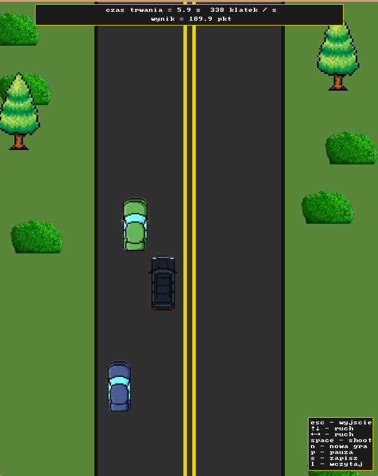

# SDL Car Game

    

# Description
SDL Car Game is a classic 2D car racing game built using SDL (Simple DirectMedia Layer) version 2.0.10. Players can navigate their car on a road, avoid obstacles, and shoot at enemies. The game incorporates basic mechanics such as movement, collision detection, shooting, and scoring. It provides an engaging experience with dynamic visuals and responsive controls.

## Features
- **2D Graphics**: Rendered using SDL library.
- **Player Controls**: Smooth movement and shooting mechanics.
- **Road Navigation**: Keep the car on the road to avoid penalties.
- **Enemies**: Engage in dynamic gameplay by shooting at enemy cars and avoiding collisions with both enemies and civilians.
- **Score Tracking**: Real-time score updates and display.
- **Game States**: Pause, save, and load game functionality.
- **Visual Effects**: Explosion animations and detailed environment rendering.
- **FPS Counter**: Displays frames per second for performance monitoring.

## Controls
- **Arrow Keys**: Move the car up, down, left, or right.
- **Space Bar**: Shoot.
- **N**: Start a new game.
- **P**: Pause/Unpause the game.
- **S**: Save the current game state.
- **L**: Load a saved game state.
- **Esc**: Quit the game.
